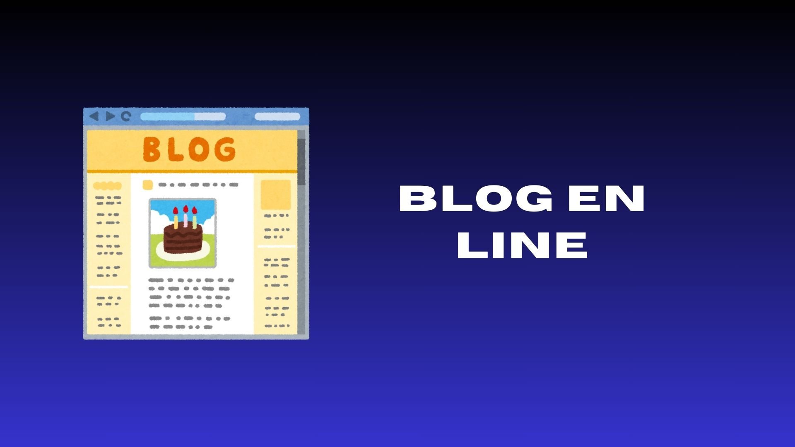
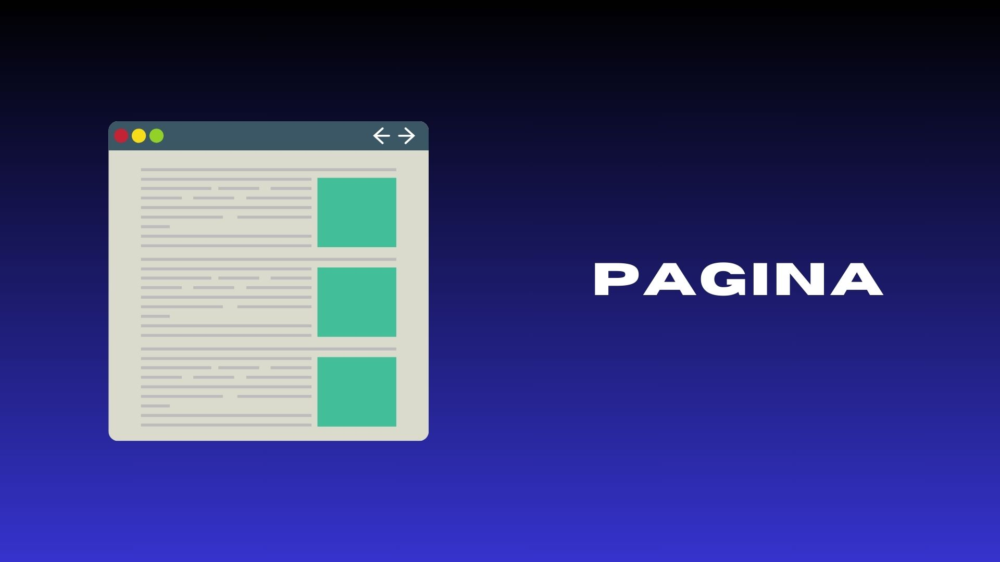

# web-002

<html lang="es">

<html lang="es">
<head>
    <meta charset="UTF-8">
    <meta name="viewport" content="white=device-width, initial-scale=1.0">

<body>

    
    
    
        

        
    
Te creamos tu pagina

<body style="background-color: black;"> 
</body>

<html lang="es">
<head>
    <meta charset="UTF-8">
    <meta name="viewport" content="width=device-width, initial-scale=1.0">
    <title>Botón con Hipervínculo</title>
    
</head>
<body>
    <a href="https://ice200626.github.io/web-001/" class="boton">atras</a>
</body>
</html>

<html lang="es">
<head>
    <meta charset="UTF-8">
    <meta name="viewport" content="width=device-width, initial-scale=1.0">

</head>
<body>
    
</body>
</html>

<html lang="es">
<head>
    <meta charset="UTF-8">
    <meta name="viewport" content="width=device-width, initial-scale=1.0">
    <title>Botón con Hipervínculo</title>
    
</head>
<body>
    <a href="https://ice200626.github.io/web-003/" class="btn">entrar</a>
</body>
</html>

<html lang="es">
<head>
    <meta charset="UTF-8">
    <meta name="viewport" content="width=device-width, initial-scale=1.0">
  
</head>
<body>
    
</body>
</html>

<html lang="es">
<head>
    <meta charset="UTF-8">
    <meta name="viewport" content="width=device-width, initial-scale=1.0">
    <title>Botón con Hipervínculo</title>
    
</head>
<body>
    <a href="https://ice200626.github.io/web-003/" class="btn">entrar</a>
</body>
</html>

<html lang="es">
<head>
    <meta charset="UTF-8">
    <meta name="viewport" content="width=device-width, initial-scale=1.0">
   
</head>
<body>
    
</body>
</html>

<html lang="es">
<head>
    <meta charset="UTF-8">
    <meta name="viewport" content="width=device-width, initial-scale=1.0">
    <title>Botón con Hipervínculo</title>
    
</head>
<body>
    <a href="https://ice200626.github.io/web-003/" class="btn">entrar</a>
</body>
</html>

<html lang="es">
<head>
    <meta charset="UTF-8">
    <meta name="viewport" content="width=device-width, initial-scale=1.0">
 
</head>
<body>
    
</body>
</html>

<html lang="es">
<head>
    <meta charset="UTF-8">
    <meta name="viewport" content="width=device-width, initial-scale=1.0">
    <title>Botón con Hipervínculo</title>
    
</head>
<body>
    <a href="https://ice200626.github.io/web-003/" class="btn">entrar</a>
</body>
</html>

<html lang="es">
<head>
    <meta charset="UTF-8">
    <meta name="viewport" content="width=device-width, initial-scale=1.0">
  
    
</head>
<body>
    <h1></h1>
</body>
</html>
